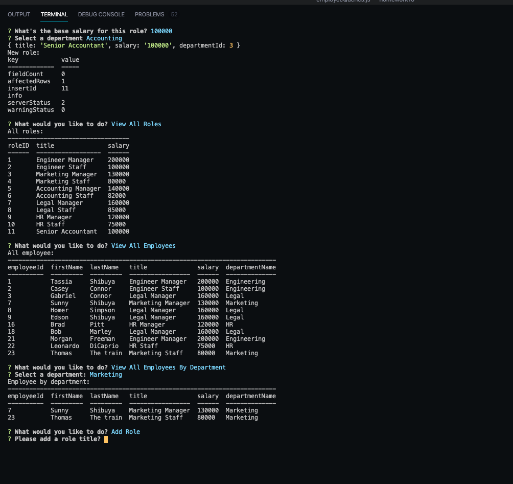

# Employee Tracker

## Description

Interfaces that make it easy for non-developers to view and interact with information stored in databases this is a solution for managing a company's employees using node, inquirer, and MySQL.

The command-line application that allows the user to:

  * Add departments, roles, employees

  * View departments, roles, employees

  * Update employee roles

  * Update employee managers

  * View employees by manager

  * Delete departments, roles, and employees

## User story

```
As a business owner
I want to be able to view and manage the departments, roles, and employees in my company
So that I can organize and plan my business
```

[Link to GitHub repo: Employee Taker](https://github.com/Tassim/homework10)
